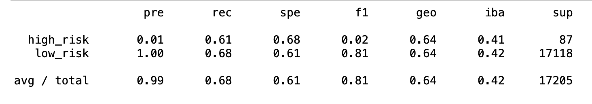
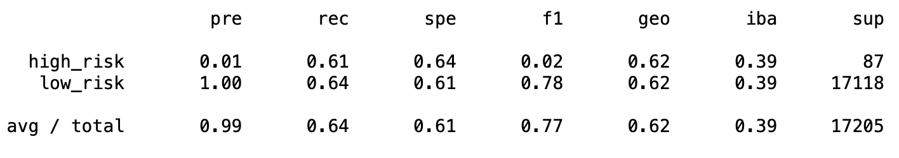
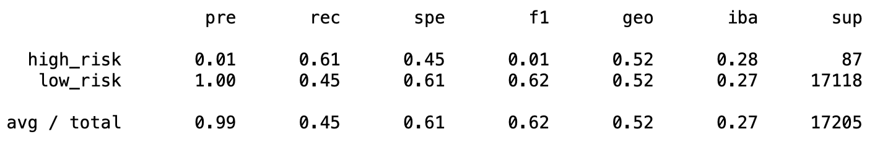
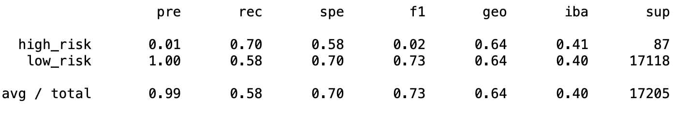
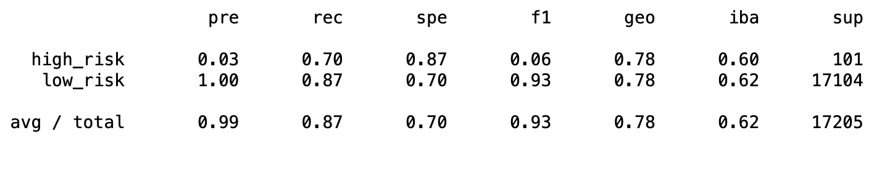
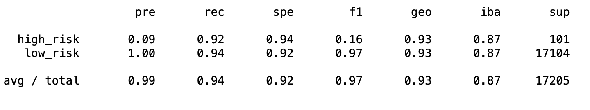

# Credit_Risk_Analysis
## Project Overview

The purpose of this project is to build and evaluate models using resampling. We are dealing with credit and 
when dealing with credit, we are dealing with an inherently unbalanced classification problem, as good loans easily outnumber risky loans.
Therefore, we will employ different techniques to train and evaluate models with unbalanced classes and conclude which if any model can be used to predict credit risk. 

# Results
# Accuracy, Precision and Recall Scores
## NaiveRandomOversampling

  
**Accuracy Score :** 0.65 
**Precision score :** 0.99 
**Recall score :** 0.68

## SMOTE Oversampling
  
**Accuracy Score :** 0.62 
**Precision score :** 0.99 
**Recall score :** 0.64

## ClusterCentroids
**Accuracy Score :** 0.53  
  
**Accuracy Score :** 0.53 
**Precision score :** 0.99 
**Recall score :** 0.45

## SMOTEENN

  
**Accuracy Score :** 0.64 
**Precision score :** 0.99 
**Recall score :** 0.58

## BalancedRandomForestClassifier

  
**Accuracy Score :** 0.64 
**Precision score :** 0.99 
**Recall score :** 0.87

## EasyEnsembleClassifier

  
**Accuracy Score :** 0.93 
**Precision score :** 0.99 
**Recall score :** 0.92

## Summary 

Out of the six models we evalueated, five show accuracy scores between 53% and 65%. **NaiveRandom** and **SMOTE** Oversampling, **Cluster Centroids** and **SMOTEENN** also show poor results in their recall scores. Because of this combination of low accuracy and recall scores these four models should not be prefered to predict credit risk. Moving forward, the **BalancedRandomForestClassifier** counters the low accuracy score (64%) with a fair recall score of 87%. This makes the model more balanced but still not ideal for our purpose. Last but not least, the **EasyEnsembleClassifier** scores an amazing 93% in accuracy while also scoring 92% in recall. This is a very accurate and trustworthy model that can be used to predict credit risk. 
