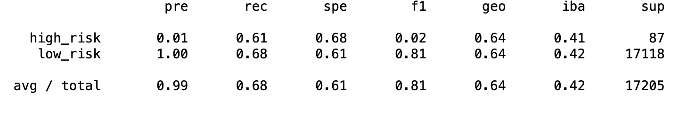

# Credit_Risk_Analysis
## Project Overview
## Results
# Accuracy Scores
  
# Accuracy Precision and Recall Scores
### NaiveRandomOversampling
**Accuracy Score :** 0.65  

#### Summary of Results

### SMOTE Oversampling
**Accuracy Score :** 0.62  

#### Summary of Results

### ClusterCentroids
**Accuracy Score :** 0.53  

#### Summary of Results

### SMOTEENN
**Accuracy Score :** 0.64  

#### Summary of Results

### BalancedRandomForestClassifier
**Accuracy Score :** 0.64  

#### Summary of Results

### EasyEnsembleClassifier
**Accuracy Score :** 0.93  

#### Summary of Results

